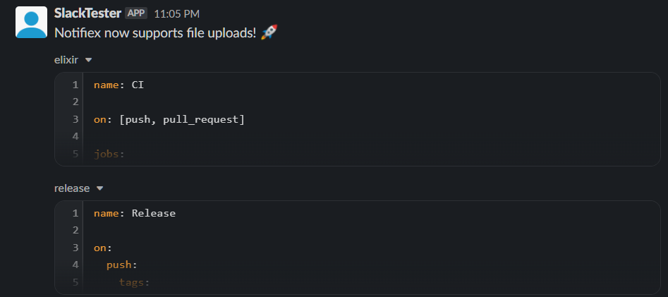

<h1>Slack</h1>

- [Retrieving tokens](#retrieving-tokens)
- [Using Notifiex](#using-notifiex)
  - [Sending messages](#sending-messages)
  - [Uploading files](#uploading-files)

## Retrieving tokens

[Read this guide](https://api.slack.com/authentication/basics) to retrieve the bot tokens for your app.

## Using Notifiex

Once retrieved, [add Notifiex to your project](https://github.com/burntcarrot/notifiex#installation).

### Sending messages

Send a basic message to Slack:

```elixir
> Notifiex.send(:slack, %{text: "Notifiex is cool! 🚀", channel: "general"},  %{token: "SECRET"})
```

### Uploading files

You can also send files by specifying the files (`files:`) as a list, and the channel IDs as a comma-separated string (`channel_ids:`) inside options:

```elixir
> Notifiex.send(:slack, %{text: "Notifiex now supports file uploads! 🚀", channel: "general"},  %{token: "SECRET", files: ["/home/user/projects/notifiex/notifiex/.github/workflows/elixir.yml", "/home/user/projects/notifiex/notifiex/.github/workflows/release.yml"], channel_ids: "C1234"})
```


