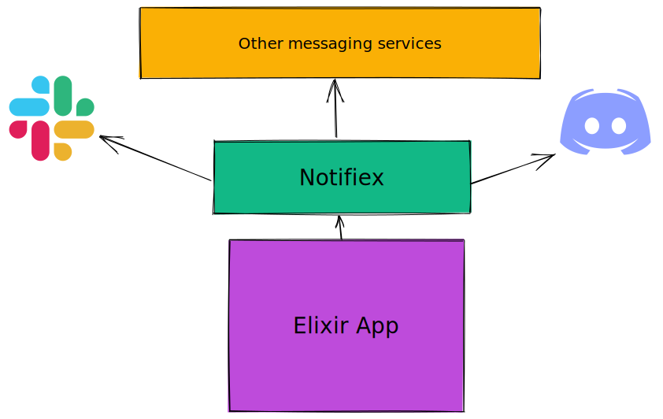

## A dead simple Elixir library for sending notifications to various messaging services.

### How does it work?

Notifiex can be added to any Elixir application, which allows the app to send notifications to services like Slack, Discord, etc.

No need to implement and craft complex solutions, Notifiex makes use of official APIs, instead of third-party client libraries for interacting with services.

Once installed, sending a message/notification is super easy:

```
> Notifiex.send(:slack, %{text: "Notifiex is cool! 🚀", channel: "general"},  %{token: "SECRET"})
```

Here is an overview:



<sup><a href="https://excalidraw.com/#json=YREJy48srbJ98Nj396_9Q,onUA7l8dKg7IBAV6fM_eMw">Excalidraw Link</a></sup>

### I'm satisfied. Show me how to install it.

Check out the [Github repository](https://github.com/burntcarrot/notifiex) for more details.

### Which services does Notifiex support?

Supported:

<ul class="fa-ul">
  <li><i class="fa-li fa fa-check-square-o"></i>Slack</li>
  <li><i class="fa-li fa fa-check-square-o"></i>Discord</li>
</ul>

Planned for future releases:

<ul class="fa-ul">
  <li><i class="fa-li fa fa-spinner fa-spin"></i>Linear</li>
  <li><i class="fa-li fa fa-spinner fa-spin "></i>Mattermost</li>
  <li><i class="fa-li fa fa-spinner fa-spin "></i>Mailgun</li>
  <li><i class="fa-li fa fa-spinner fa-spin "></i>Microsoft Teams</li>
  <li><i class="fa-li fa fa-spinner fa-spin "></i>Plivo</li>
  <li><i class="fa-li fa fa-spinner fa-spin "></i>SendGrid</li>
  <li><i class="fa-li fa fa-spinner fa-spin "></i>Twitter</li>
  <li><i class="fa-li fa fa-spinner fa-spin "></i>Telegram</li>
  <li><i class="fa-li fa fa-spinner fa-spin "></i>Zulip</li>
  <li><i class="fa-li fa fa-spinner fa-spin "></i>Rocket.Chat</li>
  <li><i class="fa-li fa fa-spinner fa-spin "></i>Google Chat</li>
</ul>

<hr>

##### Disclaimer:

Notifiex doesn't guarantee message delivery. Message retries are not supported for now. Please use with caution.
